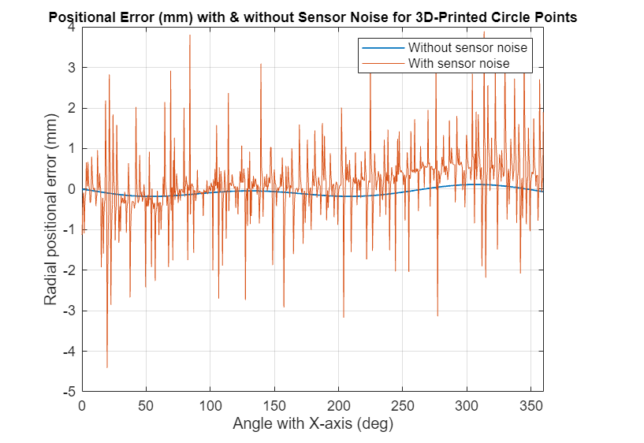

# Cartesian Robot Design with Simscape

This project shows how to create a system-level simplified parametric 
Cartesian robot model in Simscape&trade; Multibody&trade; to accelerate 
Computer Aided Design (CAD) development. 
Cartesian robots operate on three linear axes (X, Y, and Z). They are 
widely used in applications such as CNC machining, 3D printing, and 
automated assembly due to their straightforward movement and control. The 
development of Cartesian robots involves the 
design, control, and implementation of mechanical systems capable of 
performing precise tasks. Mechanical designers often use Computer-Aided 
Design (CAD) models to evaluate a design. To meet all the functional 
requirements, the CAD design process is generally iterative and can be 
time consuming. You can accelerate the development process by starting 
with a system-level analysis to evaluate your options.

This project contains a system-level simplified parametric Cartesian robot 
model for 3D printing operation. Run this model for Cantilever Cartesian or 
Gantry robot configuration. Create custom trajectories to analyze the path 
tracing for 3D printing operation.

To design your own Cartesian robot, you can leverage the existing 
custom library blocks or create your new custom blocks.

The project contains custom library blocks such as Linear Stage, Column, 
Mount. The custom library blocks serve as early-stage or system-level 
mechanical design tools for quick prototyping and development of a 
simplified parametric Cartesian robot. The custom library blocks use the 
foundation of Simscape Multibody. You can parameterize the custom library 
blocks to suit your application and assemble them with an electrical 
actuation system and a multiloop control system.

This project contains workflows that show you how to:
1. Develop a Cartesian robot model programmatically using Simscape Multibody 
in MATLAB&reg;.

2. Perform positional accuracy analysis for a Cartesian robot to 
determine accuracy for a 3D printing operation.

.

## Setup 
* Clone the project repository.
* Open CartesianRobotSimscape.prj to get started with the project. 
* Requires MATLAB&reg; release R2024a or newer.

Copyright 2024 The MathWorks, Inc.